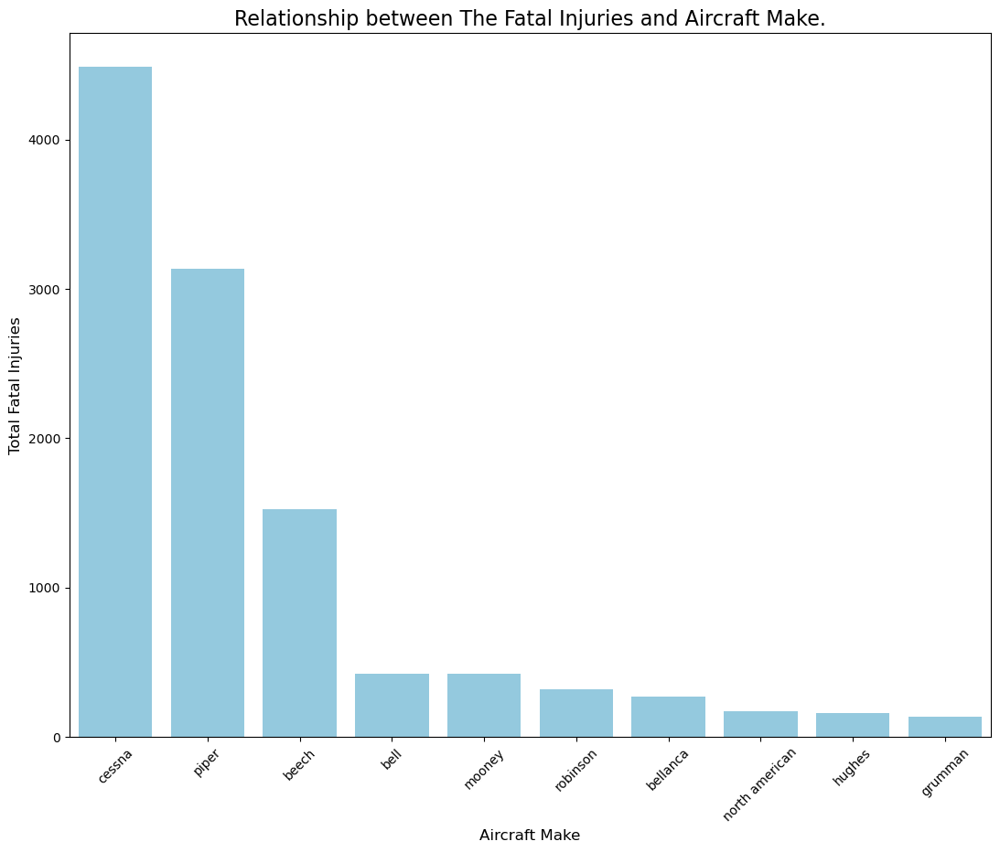
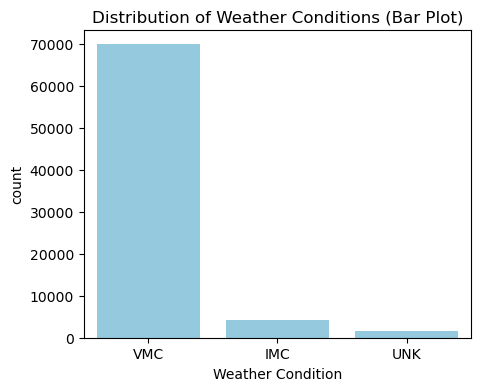

# Aviation Strategies and Risk Evasion.
- The dataset had **88889 rows and 31 columns**. It comprised of:
    - The type of aircraft makes and models.
    - The engine type used for various aicraft. 
    - The total injuries(The fatal , minor and serious injuries) and total uninjured victims, etc.
## Purpose of the project
- This visual analyzes the Aviation Accident Dataset in order to help the company assess Aircaft safety and avoid purchase of high risk aircraft.
### Stakeholders
This project was created to address the needs of the following stakeholders:
- **Safety and Compliance Teams**: Focused on accident data to enhance safety measures and compliance.
- **Aircraft Purchasing Teams**: Need to evaluate potential risks when purchasing new aircraft.
- **Data Analysts**: Looking for detailed analytics and visualizations.

## Data Understanding and Analysis
This data was sourced from kaggle. It comprises of **75685 rows and 22 columns** after thorough cleaning.

### Tableau visualization
- for more detailed analysis of Aviation Strategies and Evasion , explore interactive Visualization
(https://public.tableau.com/app/profile/lisa.mwangi/viz/project_17330402095660/AviationAccidentDashboard?publish=yes)

## Conclusion
Based on the analysis key insights and recommendations were derived that will be used to assess the aircraft safety and management:
-Aircraft safety trends: Aircraft such as Cessna have been involved in accidents this maybe due to preferability to that specific aicraft make as compared to others. 
 - If this is the case Maintainence Taskforce should be made in order to prevent and reduce accidents rates in the company.

-Engine type safety: Engine type such as 1.0 is also most commonly used. Further research has created an understanding that this types of engine are mostly located on the left and can get you from one point to the other efficiently. But the current shows that it is commonly involved in accidents.

-Need for expansive research: Further research and expansive analysis is required in order to omit speculations.
